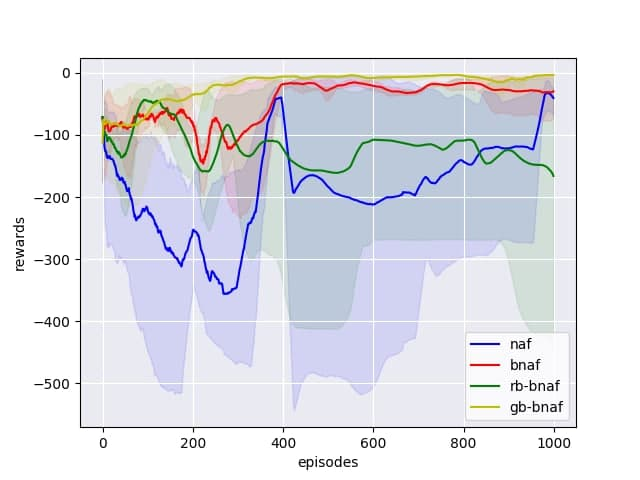
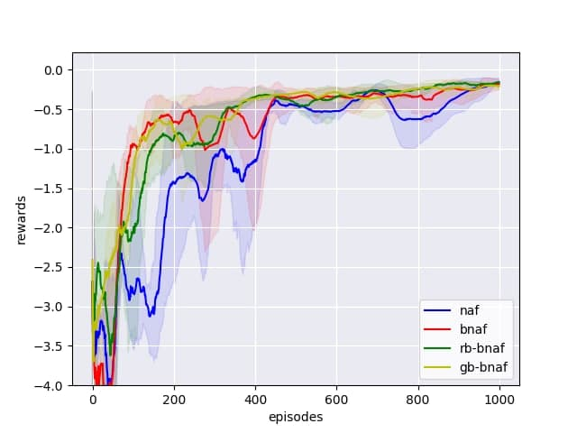
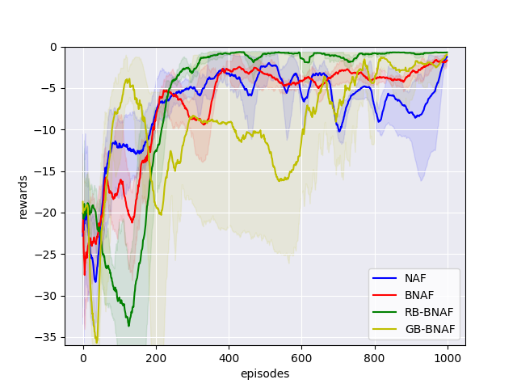
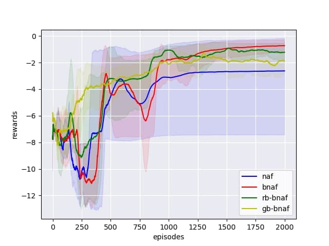

  
# This repository is the official implementation of "Continuous Deep Q-Learning in Optimal Control Problems: Normalized Advantage Functions Analysis"

It currently includes code of optimal control problems and models from the paper. The following optimal control problems are considered:    
    
- Target Problem
- Van der Pol oscillator    
- Pendulum
- Dubins Car    
 
 ## Requirements 
 
For training and evaluating described models, you will need python 3.6. To install requirements:    
    
```    
pip install -r requirements.txt    
```    
    
## Training    
To train, run this command:    
    
```    
python train.py --config <path to config file>  
```    
    
### **Training config file  structure:** 

The training configuration file is presented as a json file with 3 required components - *environment*, *model*, *train_settings*.  
Each of these blocks has its own fields, presented in the tables below:  
  
#### environment's fields:  
  
| Parameter name| Type | example | Description |    
|-----------|------------|---------|-------------|    
| env_name|string| dubins-car| Optimal control task to solve    
|dt| float  | 0.1        | Discretization step of continuous environment  

Possible *env_name* values:  
- *target-problem*
- *van-der-pol*  
- *pendulum*
- *dubins-car*  
  
#### model's fields:   

| Parameter name| Type | example | Description |    
|-----------|------------|---------|-------------|    
| model_name|string| naf| One of the algorithms, described in article    
|lr| float  | 0.001        | Learning rate  
|gamma| float  | 0.99        |Reward discount rate  

Possible *model_name* values:  
- *naf* - original Normalized Advanced Functions algorithm.  
- *bnaf* - bounded NAF.  
- *rb-bnaf* - reward-based bounded NAF.  
- *gb-bnaf* - gradient-based bounded NAF.  
  
#### train_settings fields:

| Parameter name| Type | example | Description |    
|-----------|------------|---------|-------------|    
| epoch_num|int| 1000|  Number of training epochs   
|batch_size| int| 256        | Batch size  
|gamma| float  | 0.99        |Reward discount rate  
|render| boolean  | false        | Is need to visualize the environment during training  
|random_seed| int| 2021        | Random seed to fix stochastic effects  
|save_rewards_path| path| \path\to\file       |   Path to save training reward history in numpy array format  
|save_model_path| path| \path\to\file       |   Path to save trained agent  
|save_plot_path| path| \path\to\file       |   Path to save training reward history plot  
  
  
  
  
  
#### train_config.json example:

```
{    
  "environment": {    
     "env_name": "dubins-car",      
     "dt": 0.1    
 },  
  "model": {    
     "model_name": "naf",    
     "lr": 0.0005,    
     "gamma": 1    
  },    
  "train_settings": {    
     "epoch_num": 1000,    
     "batch_size": 256,    
     "render": false,    
     "random_seed": [2021, 2022, 2023],    
     "save_rewards_path": "./rewards/dubinsCar/dt0.1/naf"    
  }    
}    
```    
 > You can find prepared config files for all environment's in folder **/configs**.  
## Evaluation    
 To evaluate pre-trained model, run:    
    
```  
python eval.py --config <path to config file>    
```    
This script prints to the console all the states of the environment during the evaluation and outputs the final score.    
  #### **Evaluation config file  structure:**   
  The configuration file is presented as a json file with 3 required params - *environment*, *checkpoint*, *random_seed*.  
    
  
    
| Parameter name | Type | example | Description |    
|-----------|------------|---------|-------------|    
| environment|json |{"env_name": "dubins-car",  "dt": 0.1 } | the same object as in the training section  
|checkpoint    |path |  \path\to\checkpoint\file               | Path to pre-trained model  
|random_seed|int|  2021               | Random seed to fix stochastic effects  
    
> Note that you can only use the model for the task on which it was trained    

#### eval_config.json example:

```
{    
  "environment": {    
     "env_name": "dubins-car",      
     "dt": 0.1    
 },  
  "checkpoint": ./naf_checkpoint,
  "random_seed": 2021      
}    
```    
    
 ## Results
We use the same learning parameters of every our tasks. We apply neural networks with two layers of 256 and 128 rectified linear units (ReLU) and learn their used ADAM with the learning rate **lr = 0.0005**. We use **batch size equal to 256** and smoothing parameter **tau = 0.001**. We also took **dt = 0.1**. All calculations were performed on a personal computer in a standard way.    
    
Our models achieves the following reward's on:    
    
|                    | Target problem  | Van der Pol oscillator | Pendulum | Dubins car |    
| ------------------ |---------------- | ---------------------- | --------- | --------- |    
| NAF                |     -40.3163     |         -0.4144        |  -3.4032  |  -2.6129  |    
| BNAF              |     -29.7177     |         -0.1814        |  -0.9545  |  -0.5529  |    
| RB-BNAF            |     -166.1029     |         -0.1599        |  -2.7187  |  -0.9786  |    
| GB-BNAF            |     -3.2337     |         -0.2114        |  -0.6806  |  -1.3784  |    
    
**Plots:**    
 Figures below show the learning results of the algorithms for considered examples of optimal control problems. The figure shows results averaged over 3 seeds.   
    
|  |  |    
|:----:|:----:|    
|  *Target problem* | *Van der Pol oscillator* |    
|  |  |    
|  *Pendulum* | *Dubins car* |    
    
#### Contributing 
If you'd like to contribute, or have any suggestions for these guidelines, you can open an issue on this GitHub repository.    
    
All contributions welcome!
