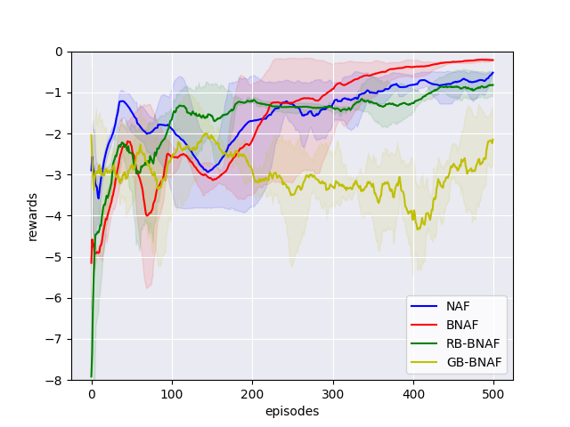

# Continuous Deep Q-Learning in Optimal Control Problems: Normalized Advantage Functions Analysis
This repository is the official implementation of ["Continuous Deep Q-Learning in Optimal Control
Problems: Normalized Advantage Functions Analysis"](https://arxiv.org/abs/2030.12345).
It currently includes code and models for some optimal control tasks:

- Simple motions
- Van der Pol oscillator
- Pendulum with terminal time
- Dubins Car

## Requirements

To install requirements:

```
pip install -r requirements.txt
```

## Training

To train the model(s) in the paper, run this command:

```
python train.py 
     --env=<env-name> \
     --model=<model-name> \
     --epoch-num=<int>
     --dt=<float> \
     --lr=<float> \
     --batch=<int> \
     --save-agent-path=<path> \
     --save-train-rewards-path=<path> \
     --save-train-plot-path=<path>
```

**params:**

| Parameter | Type | Default | Description |
|-----------|------------|---------|-------------|
| --env    |*simple-motions* &#124; *van-der-pol* &#124; *pendulum* &#124; *dubins-car*|simple-motions| Optimal control task to solve
|--model    |*naf* &#124; *b-naf* &#124; *rb-naf* &#124; *gb-naf* | naf           | One of the models, described in article
|--epoch-num| int | 500           | Number of training epochs
|--dt       | float | 0.5          | Discretization step in continuous tasks
|--lr       | float | 0.001        | Learning rate
|--batch    | int | 128          | Batch size
|--save-agent-path| Path | | Path to save trained agent
|--save-train-rewards-path| Path | | Path to save training reward history in numpy array format
|--save-train-plot-path   | Path | | Path to save training reward history plot

**Usage example:**
```
python train.py --task=pendulum --model=rb-naf --dt=0.5 --lr=0.001 --batch=128
```


## Evaluation

To evaluate pre-trained model, run:

```eval
python eval.py --env=<env-name> --model=<model-name>
```

This script prints to the console all the states of the environment during the evaluation and outputs the final score.

## Results

Our models achieves the following performance on:

|                    | Simple motions  | Van der Pol oscillator | Pendulum | Dubins car |
| ------------------ |---------------- | ---------------------- | --------- | --------- |
| NAF                |     0.28296     |         0.31336        |  0.93049  |  1.37627  |
| BNAF               |     0.29308     |         0.18098        |  0.81743  |  0.72863  |
| RB-BNAF            |     0.21927     |         0.49881        |  0.68373  |  0.75363  |
| GB-BNAF            |     0.21882     |         1.34460        |  0.69741  |  2.83410  |

**Plots**

|  |  |
|:----:|:----:|
|  *Simple Motions* | *Van der Pol oscillator* |
|  |  |
|  *Pendulum* | *Dubins car* |


## Contributing
If you'd like to contribute, or have any suggestions for these guidelines, you can open an issue on this GitHub repository.

All contributions welcome!