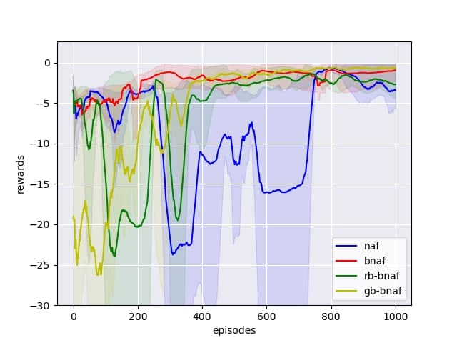

# Continuous Deep Q-Learning in Optimal Control Problems: Normalized Advantage Functions Analysis
This repository is the official implementation of "Continuous Deep Q-Learning in Optimal Control
Problems: Normalized Advantage Functions Analysis".
It currently includes code and models for some optimal control tasks:

- Simple motions
- Van der Pol oscillator
- Pendulum with terminal time
- Dubins Car

> You can find algorithms and tasks theoretical description in the paper.

## Requirements
For training and evaluating described models, you will need python 3.6.

To install requirements:

```
pip install -r requirements.txt
```

## Training

To train the model(s) in the paper, run this command:

```
python train.py 
     --env=<env-name> \
     --algorithm=<algorithm-name> \
     --epoch-num=<int>
     --dt=<float> \
     --gamma=<float> \
     --lr=<float> \
     --batch=<int> \
     --save_model_path=<path> \
     --save_rewards_path=<path> \
     --save_plot_path=<path>
```

**params:**

| Parameter | Type | Default | Description |
|-----------|------------|---------|-------------|
| --env    |*simple-motions* &#124; *van-der-pol* &#124; *pendulum* &#124; *dubins-car*| | Optimal control task to solve
|--algorithm|*naf* &#124; *bnaf* &#124; *rb-bnaf* &#124; *gb-bnaf* |           | One of the algorithms, described in article
|--epoch_num| int   | 500           | Number of training epochs
|--gamma    | float | 1            | Reward discount rate
|--dt       | float | 0.5          | Discretization step of continuous environment
|--lr       | float | 0.001        | Learning rate
|--batch    | int | 128          | Batch size
|--save_model_path| Path | | Path to save trained agent
|--save_rewards_path| Path | | Path to save training reward history in numpy array format
|--save_plot_path   | Path | | Path to save training reward history plot

**Usage example:**
```
python train.py --env=pendulum --algorithm=rb-bnaf --dt=0.5 --lr=0.001 --batch=128
```


## Evaluation

To evaluate pre-trained model, run:

```eval
python eval.py --env=<env-name> --model=<path>
```

This script prints to the console all the states of the environment during the evaluation and outputs the final score.

**params:**

| Parameter | Type | Default | Description |
|-----------|------------|---------|-------------|
| --env    |*simple-motions* &#124; *van-der-pol* &#124; *pendulum* &#124; *dubins-car*| | Optimal control task to solve
|--model    |path |                 | Path to pre-trained model

> Note that you can only use the model for the task on which it was trained


## Results
We use the same learning parameters of every our tasks. 
We used neural networks with two layers of 256 and 128 rectified linear units (ReLU) and learn their used ADAM with the learning rate **lr = 0.001**.
We use **batch size equal to 128** and smoothing parameter **tau = 0.001**.
Also we take **dt = 0.5**. All calculations were performed on a personal computer in a standard way.


Our models achieves the following performance on:

|                    | Simple motions  | Van der Pol oscillator | Pendulum | Dubins car |
| ------------------ |---------------- | ---------------------- | --------- | --------- |
| NAF                |     0.28296     |         0.31336        |  0.93049  |  1.37627  |
| BNAF               |     0.29308     |         0.18098        |  0.81743  |  0.72863  |
| RB-BNAF            |     0.21927     |         0.49881        |  0.68373  |  0.75363  |
| GB-BNAF            |     0.21882     |         1.34460        |  0.69741  |  2.83410  |

**Plots:**

Figures below show the learning results of the algorithms for considered examples of optimal control problems.
The figures display the top 5 results from 20 runs of each algorithm.
The bold lines represent average values for these top 5 runs.

|  |  |
|:----:|:----:|
|  *Simple Motions* | *Van der Pol oscillator* |
|  |  |
|  *Pendulum* | *Dubins car* |

Figures above shows that BNAF and RB-BNAF have more stable learning then NAF in all examples.
The most stable and fastest algorithm is RB-BNAF,
although it has the result slightly worse than NAF and BNAF in Van der Pol oscillator problem.
Also we can see that GB-BNAF has the good result only in Simple motions and Pendulum problems.
Thus, we consider that GB-BNAF is the most unsuccessful modification of NAF.

|  |  |
|:----:|:----:|
|  *Simple Motions* | *Van der Pol oscillator* |
|  |  |
|  *Pendulum* | *Dubins car* |

 
Figures above shows the learning results for RB-BNAF, when we reduce **dt** in the middle of the learning.
We can see that it does not make the algorithm results worse,
although the learning becomes slower in Van der Pol oscillator and Dubins car problems.

## Contributing
If you'd like to contribute, or have any suggestions for these guidelines, you can open an issue on this GitHub repository.

All contributions welcome!